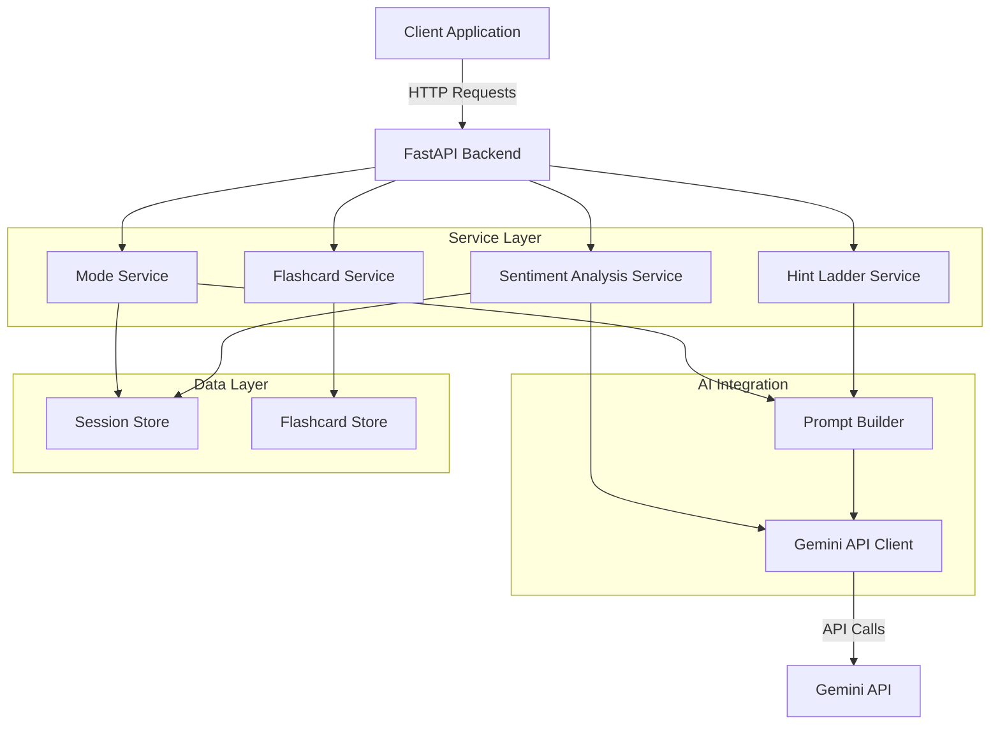

# Design Document: LearnFlow AI

## Overview

LearnFlow AI is a real-time, dual-mode AI platform built on a FastAPI backend with Gemini API integration. The system provides two distinct operational modes: Learning Mode for concept explanation and Debugging Mode for code analysis with progressive hints. The architecture emphasizes real-time sentiment analysis, adaptive learning through confusion detection, and persistent session management.

The system follows a layered architecture pattern:
- **API Layer**: FastAPI endpoints handling HTTP requests
- **Service Layer**: Business logic for mode management, hint generation, and flashcard creation
- **AI Integration Layer**: Gemini API client with retry logic and response processing
- **Data Layer**: Session storage and flashcard persistence
- **Analysis Layer**: Sentiment analysis and confusion detection

## Architecture

### System Architecture



### Data Flow

**Learning Mode Flow:**
1. User sends concept question → API receives request
2. API validates request → Mode Service checks current mode
3. Sentiment Analysis Service analyzes message sentiment
4. If high confusion detected → Adjust response complexity
5. Prompt Builder creates learning-focused prompt with style preferences
6. Gemini Client sends request → Receives explanation
7. Response formatted and returned to user
8. Session Store updated with interaction

**Debugging Mode Flow:**
1. User submits code → API receives code input
2. Mode Service confirms Debugging Mode active
3. AI Integration analyzes code for errors
4. Hint Service generates three-tier hint ladder
5. User requests hint → Next hint level revealed
6. If error detected → Flashcard Service creates flashcard
7. Flashcard stored in Flashcard Store
8. Session Store updated with debugging session

## Components and Interfaces

### 1. API Layer (FastAPI)

**Endpoints:**

```python
# Mode Management
POST /api/mode/select
  Request: { "mode": "learning" | "debugging", "user_id": str }
  Response: { "mode": str, "status": "success" }

# Message Submission
POST /api/message
  Request: { 
    "user_id": str, 
    "message": str, 
    "mode": str,
    "code": str | null 
  }
  Response: { 
    "response": str, 
    "confusion_level": str,
    "flashcard_generated": bool 
  }

# Hint Requests (Debugging Mode)
POST /api/hint/next
  Request: { "user_id": str, "session_id": str }
  Response: { 
    "hint_type": "conceptual" | "syntax" | "solution",
    "hint_content": str,
    "has_next": bool 
  }

# Flashcard Management
GET /api/flashcards/{user_id}
  Response: { "flashcards": [Flashcard] }

POST /api/flashcards/review
  Request: { "user_id": str, "flashcard_id": str, "rating": int }
  Response: { "status": "success" }

# Learning Style
PUT /api/preferences/style
  Request: { "user_id": str, "style": "eli5" | "visual" | "standard" }
  Response: { "style": str, "status": "success" }

# Session History
GET /api/session/{user_id}
  Response: { "history": [Interaction], "flashcards": [Flashcard] }

POST /api/session/export
  Request: { "user_id": str }
  Response: { "export_url": str }
```

### 2. Mode Service

**Responsibilities:**
- Manage current operational mode (Learning/Debugging)
- Maintain mode-specific context
- Coordinate with Prompt Builder for mode-appropriate prompts

**Interface:**

```python
class ModeService:
    def set_mode(user_id: str, mode: Mode) -> ModeContext
    def get_current_mode(user_id: str) -> Mode
    def get_mode_context(user_id: str) -> ModeContext
    def switch_mode(user_id: str, new_mode: Mode) -> ModeContext
```

### 3. Hint Ladder Service

**Responsibilities:**
- Generate three-tier progressive hints for debugging
- Manage hint state and progression
- Prevent hint skipping unless explicitly allowed

**Interface:**

```python
class HintLadderService:
    def generate_hints(code: str, error_analysis: ErrorAnalysis) -> HintLadder
    def get_next_hint(session_id: str) -> Hint
    def get_current_hint_level(session_id: str) -> HintLevel
    def reset_hints(session_id: str) -> None
```

**Hint Generation Strategy:**
- **Conceptual Hint**: Analyze error type → Generate logical explanation without code references
- **Syntax Hint**: Identify error location → Provide line number and keyword
- **Solution Hint**: Generate corrected code → Format with explanation

### 4. Flashcard Service

**Responsibilities:**
- Detect errors and mistakes from AI analysis
- Generate flashcard objects automatically
- Store flashcards with context and timestamps
- Manage flashcard retrieval and review

**Interface:**

```python
class FlashcardService:
    def create_flashcard(error: Error, correction: str, context: str) -> Flashcard
    def save_flashcard(user_id: str, flashcard: Flashcard) -> str
    def get_flashcards(user_id: str, filters: dict) -> List[Flashcard]
    def mark_reviewed(flashcard_id: str, rating: int) -> None
```

### 5. Sentiment Analysis Service

**Responsibilities:**
- Analyze message sentiment in real-time
- Detect confusion patterns (negative sentiment, repeated questions)
- Calculate and update Confusion Level
- Trigger UI badge updates

**Interface:**

```python
class SentimentAnalysisService:
    def analyze_sentiment(message: str) -> SentimentScore
    def detect_confusion(user_id: str, message: str, history: List[str]) -> ConfusionLevel
    def update_confusion_state(user_id: str, level: ConfusionLevel) -> UIState
    def check_repeated_questions(current: str, history: List[str]) -> bool
```

**Confusion Detection Algorithm:**
1. Analyze current message sentiment using Gemini API
2. Check message history for similar questions (last 5 messages)
3. Calculate confusion score: `score = (negative_sentiment * 0.6) + (repetition_factor * 0.4)`
4. Map score to level: Low (0-0.3), Medium (0.3-0.6), High (0.6-1.0)
5. If High → Trigger simplified explanation mode

### 6. Gemini API Client

**Responsibilities:**
- Manage API authentication and requests
- Implement retry logic with exponential backoff
- Handle rate limiting and errors
- Process and validate responses

**Interface:**

```python
class GeminiClient:
    def send_request(prompt: str, config: RequestConfig) -> Response
    def analyze_code(code: str, language: str) -> CodeAnalysis
    def generate_explanation(concept: str, style: LearningStyle) -> str
    def analyze_sentiment(text: str) -> SentimentScore
```

**Retry Strategy:**
- Initial request timeout: 5 seconds
- Retry attempts: 3
- Backoff: Exponential (1s, 2s, 4s)
- On final failure: Return cached response or error message

### 7. Prompt Builder

**Responsibilities:**
- Construct mode-specific prompts for Gemini API
- Incorporate learning style preferences
- Add context from session history
- Format code for analysis

**Interface:**

```python
class PromptBuilder:
    def build_learning_prompt(question: str, style: LearningStyle, context: str) -> str
    def build_debugging_prompt(code: str, language: str) -> str
    def build_hint_prompt(error: Error, level: HintLevel) -> str
    def build_sentiment_prompt(message: str) -> str
```

**Prompt Templates:**

*Learning Mode (ELI5 Style):*
```
You are a patient tutor explaining concepts to a beginner. Use simple everyday language, 
avoid jargon, and provide concrete analogies. The student asked: "{question}"

Context: {previous_interactions}
Confusion Level: {level}

Provide a clear explanation with:
1. Simple definition
2. Real-world analogy
3. Basic code example
```

*Debugging Mode (Hint Generation):*
```
Analyze this code and identify errors:

```{language}
{code}
```

Generate three progressive hints:
1. Conceptual: Explain the logical error without referencing specific code
2. Syntax: Provide line number and keyword where error occurs
3. Solution: Provide corrected code with explanation

Format as JSON with keys: conceptual_hint, syntax_hint, solution_hint
```

## Data Models

### Core Models

```python
from enum import Enum
from datetime import datetime
from typing import List, Optional
from pydantic import BaseModel, Field

class Mode(str, Enum):
    LEARNING = "learning"
    DEBUGGING = "debugging"

class LearningStyle(str, Enum):
    ELI5 = "eli5"
    VISUAL = "visual"
    STANDARD = "standard"

class ConfusionLevel(str, Enum):
    LOW = "low"
    MEDIUM = "medium"
    HIGH = "high"

class HintLevel(str, Enum):
    CONCEPTUAL = "conceptual"
    SYNTAX = "syntax"
    SOLUTION = "solution"

class User(BaseModel):
    user_id: str
    learning_style: LearningStyle = LearningStyle.STANDARD
    current_mode: Mode = Mode.LEARNING
    created_at: datetime = Field(default_factory=datetime.utcnow)

class Message(BaseModel):
    message_id: str
    user_id: str
    content: str
    mode: Mode
    code: Optional[str] = None
    timestamp: datetime = Field(default_factory=datetime.utcnow)

class SentimentScore(BaseModel):
    score: float  # -1.0 (negative) to 1.0 (positive)
    magnitude: float  # 0.0 to 1.0
    confusion_indicators: List[str]

class ConfusionState(BaseModel):
    user_id: str
    level: ConfusionLevel
    score: float
    timestamp: datetime
    ui_badge_color: str  # "green", "yellow", "red"

class Hint(BaseModel):
    hint_id: str
    level: HintLevel
    content: str
    revealed: bool = False

class HintLadder(BaseModel):
    session_id: str
    conceptual: Hint
    syntax: Hint
    solution: Hint
    current_level: int = 0  # 0=none, 1=conceptual, 2=syntax, 3=solution

class Error(BaseModel):
    error_type: str  # "syntax", "logic", "runtime"
    line_number: Optional[int]
    description: str
    severity: int  # 1-5

class CodeAnalysis(BaseModel):
    language: str
    errors: List[Error]
    suggestions: List[str]
    complexity_score: Optional[int]

class Flashcard(BaseModel):
    flashcard_id: str
    user_id: str
    front: str  # Error description
    back: str  # Correction explanation
    context: str  # Code or concept context
    created_at: datetime = Field(default_factory=datetime.utcnow)
    reviewed_count: int = 0
    last_reviewed: Optional[datetime] = None

class Interaction(BaseModel):
    interaction_id: str
    user_id: str
    message: Message
    response: str
    confusion_level: ConfusionLevel
    flashcard_generated: bool
    timestamp: datetime = Field(default_factory=datetime.utcnow)

class SessionHistory(BaseModel):
    user_id: str
    interactions: List[Interaction]
    flashcards: List[Flashcard]
    mode_changes: List[dict]
    started_at: datetime
    last_active: datetime

class ModeContext(BaseModel):
    mode: Mode
    user_id: str
    session_id: str
    history_context: List[str]  # Last N interactions for context
```

### Storage Schema

**Session Store (In-Memory with Persistence):**
- Key: `user_id`
- Value: `SessionHistory` object
- TTL: 24 hours of inactivity
- Persistence: JSON file or Redis

**Flashcard Store:**
- Key: `flashcard_id`
- Value: `Flashcard` object
- Indexed by: `user_id`, `created_at`
- Storage: SQLite or PostgreSQL

**Confusion State Cache:**
- Key: `user_id`
- Value: `ConfusionState` object
- TTL: Session duration
- Storage: In-memory (Redis)


## Correctness Properties

A property is a characteristic or behavior that should hold true across all valid executions of a system—essentially, a formal statement about what the system should do. Properties serve as the bridge between human-readable specifications and machine-verifiable correctness guarantees.

### Property 1: Mode Selection Consistency

*For any* user and mode selection (Learning or Debugging), setting the mode should result in the system's current mode matching the selected mode and being reflected in all subsequent API responses.

**Validates: Requirements 1.2, 1.3, 1.5**

### Property 2: Session History Preservation Across Mode Changes

*For any* user session with existing history, switching between modes should preserve all previous interactions, flashcards, and context without data loss.

**Validates: Requirements 1.4**

### Property 3: Sentiment Analysis Execution

*For any* user message, the system should analyze sentiment and return a sentiment score, regardless of message content or length.

**Validates: Requirements 2.1**

### Property 4: Confusion Detection from Negative Sentiment

*For any* message with negative sentiment score (< -0.3) or repeated similar questions in history, the system should classify the confusion level as High.

**Validates: Requirements 2.2**

### Property 5: UI Badge State Mapping

*For any* confusion state, the UI badge color should correctly map to the confusion level: red for High, yellow for Medium, green for Low.

**Validates: Requirements 2.4, 2.5**

### Property 6: Confusion History Tracking

*For any* user session, all confusion level changes should be recorded in the session history with timestamps.

**Validates: Requirements 2.6**

### Property 7: Hint Ladder Completeness

*For any* debugging request with detected errors, the system should generate exactly three hints: one conceptual (no code references), one syntax (with line number and keyword), and one solution (with corrected code).

**Validates: Requirements 3.1, 3.2, 3.3, 3.4**

### Property 8: Sequential Hint Revelation

*For any* hint ladder, requesting the next hint should reveal hints in strict order (Conceptual → Syntax → Solution), and attempting to skip levels without explicit permission should be prevented.

**Validates: Requirements 3.5, 3.6**

### Property 9: Automatic Flashcard Generation

*For any* detected error or mistake in user code or understanding, the system should automatically create a flashcard object.

**Validates: Requirements 4.1**

### Property 10: Flashcard Completeness

*For any* generated flashcard, it should contain all required fields: front (error description), back (correction), context, timestamp, and user_id.

**Validates: Requirements 4.2, 4.3, 4.5**

### Property 11: Flashcard Persistence

*For any* generated flashcard, it should be immediately saved to the user's session history and be retrievable through the flashcard API.

**Validates: Requirements 4.4, 4.6**

### Property 12: Learning Style Application

*For any* user with Visual style selected, responses should include visual elements (ASCII diagrams, structured formatting, or visual metaphors).

**Validates: Requirements 5.2**

### Property 13: Style Preference Persistence

*For any* user, their learning style preference should persist across sessions - logging out and back in should restore the same style setting.

**Validates: Requirements 5.5**

### Property 14: Immediate Style Change Application

*For any* user changing their learning style, the very next response should reflect the new style preference.

**Validates: Requirements 5.4**

### Property 15: Multi-Language Code Acceptance

*For any* programming language (Python, JavaScript, Java, C++, etc.), the system in Debugging Mode should accept and analyze code input without rejection.

**Validates: Requirements 6.1**

### Property 16: Code Analysis Execution

*For any* submitted code, the system should perform analysis and return results (either errors found or confirmation of no errors).

**Validates: Requirements 6.2**

### Property 17: Error Object Completeness

*For any* detected error, the error object should contain all required fields: error_type (syntax/logic/runtime), description, line_number (when applicable), and severity.

**Validates: Requirements 6.3, 6.4**

### Property 18: Error Severity Ordering

*For any* code analysis with multiple errors, the returned error list should be sorted by severity in descending order (highest severity first).

**Validates: Requirements 6.5**

### Property 19: Explanation Structure Completeness

*For any* concept explanation request in Learning Mode, the response should contain all three required components: definition, analogy, and practical example.

**Validates: Requirements 7.1**

### Property 20: DSA Complexity Information

*For any* Data Structures and Algorithms concept explanation, the response should include both time complexity and space complexity information.

**Validates: Requirements 7.3**

### Property 21: Interactive Code Example Provision

*For any* concept explanation, the response should include executable code examples that can be run and modified.

**Validates: Requirements 7.4**

### Property 22: Unique Session Per User

*For any* two different users, their session histories should be completely independent with unique session IDs.

**Validates: Requirements 8.1**

### Property 23: Interaction Recording

*For any* user interaction (message, mode change, flashcard generation), it should be recorded in the session history immediately with all relevant metadata.

**Validates: Requirements 8.2**

### Property 24: Session Persistence and Restoration

*For any* user session, after logging out and back in, all previous session history (interactions, flashcards, preferences) should be restored exactly as it was.

**Validates: Requirements 8.3, 8.4**

### Property 25: Complete Session Export

*For any* user requesting session export, the exported data should include all interactions, flashcards, mode changes, and timestamps.

**Validates: Requirements 8.5**

### Property 26: API Retry Logic

*For any* failed Gemini API request, the system should retry exactly 3 times with exponential backoff (1s, 2s, 4s) before giving up.

**Validates: Requirements 9.4**

### Property 27: Final Failure Error Handling

*For any* API request that fails after all retry attempts, the system should return a user-friendly error message and log the failure details.

**Validates: Requirements 9.5**

### Property 28: Request Validation Execution

*For any* API endpoint request, the system should validate the request payload against the defined schema before processing.

**Validates: Requirements 10.3**

### Property 29: Validation Failure Response

*For any* request with invalid payload, the system should return HTTP 400 status code with descriptive error details explaining what validation failed.

**Validates: Requirements 10.4**

### Property 30: CORS Header Presence

*For any* API response, appropriate CORS headers should be included to allow frontend integration.

**Validates: Requirements 10.6**

## Error Handling

### Error Categories

**1. API Integration Errors**
- Gemini API timeout or unavailability
- Rate limiting exceeded
- Invalid API responses
- Network connectivity issues

**Handling Strategy:**
- Implement retry logic with exponential backoff (3 attempts)
- Cache last successful responses for graceful degradation
- Return user-friendly error messages
- Log all failures with request context for debugging

**2. Validation Errors**
- Invalid request payloads
- Missing required fields
- Type mismatches
- Out-of-range values

**Handling Strategy:**
- Validate all inputs using Pydantic models
- Return 400 status with detailed field-level errors
- Provide examples of valid requests in error messages
- Never expose internal system details

**3. Session Management Errors**
- Session not found
- Session expired
- Concurrent modification conflicts
- Storage failures

**Handling Strategy:**
- Create new session if not found (graceful recovery)
- Implement session TTL with automatic cleanup
- Use optimistic locking for concurrent updates
- Fallback to in-memory storage if persistence fails

**4. Code Analysis Errors**
- Unsupported programming language
- Malformed code input
- Analysis timeout
- Ambiguous error detection

**Handling Strategy:**
- Detect language from code syntax or explicit parameter
- Return partial analysis if timeout occurs
- Provide best-effort error detection with confidence scores
- Allow users to provide additional context

**5. Flashcard Generation Errors**
- Unable to extract error from context
- Duplicate flashcard detection
- Storage capacity exceeded

**Handling Strategy:**
- Skip flashcard generation if extraction fails (log warning)
- Deduplicate flashcards based on error signature
- Implement flashcard limits per user with cleanup policy
- Notify user when approaching limits

### Error Response Format

All errors follow a consistent JSON structure:

```json
{
  "error": {
    "code": "ERROR_CODE",
    "message": "User-friendly error message",
    "details": {
      "field": "specific_field",
      "reason": "validation failure reason"
    },
    "timestamp": "2024-01-15T10:30:00Z",
    "request_id": "req_abc123"
  }
}
```

### Logging Strategy

**Log Levels:**
- **ERROR**: API failures, validation errors, storage failures
- **WARN**: Retry attempts, degraded functionality, approaching limits
- **INFO**: Mode changes, flashcard generation, session creation
- **DEBUG**: Request/response payloads, sentiment scores, hint generation

**Log Context:**
- User ID (anonymized in production)
- Request ID for tracing
- Timestamp with millisecond precision
- Endpoint and operation
- Error stack traces for exceptions

## Testing Strategy

### Dual Testing Approach

LearnFlow AI requires both unit testing and property-based testing for comprehensive coverage:

**Unit Tests** focus on:
- Specific examples of mode switching, hint generation, and flashcard creation
- Edge cases like empty messages, malformed code, and missing fields
- Error conditions such as API failures, validation errors, and session expiration
- Integration points between services (API → Service → Gemini Client)

**Property-Based Tests** focus on:
- Universal properties that hold across all inputs (see Correctness Properties section)
- Comprehensive input coverage through randomization
- Invariants that must be maintained (session preservation, data completeness)
- Round-trip properties (session export/import, mode switching)

### Property-Based Testing Configuration

**Framework Selection:**
- **Python**: Use `hypothesis` library for property-based testing
- Minimum 100 iterations per property test (due to randomization)
- Each test must reference its design document property using tags

**Tag Format:**
```python
@pytest.mark.property
@pytest.mark.feature("learnflow-ai")
@pytest.mark.validates("Property 1: Mode Selection Consistency")
def test_mode_selection_consistency():
    # Test implementation
```

**Test Organization:**
```
tests/
├── unit/
│   ├── test_mode_service.py
│   ├── test_hint_ladder.py
│   ├── test_flashcard_service.py
│   ├── test_sentiment_analysis.py
│   └── test_api_endpoints.py
├── property/
│   ├── test_mode_properties.py
│   ├── test_session_properties.py
│   ├── test_hint_properties.py
│   ├── test_flashcard_properties.py
│   └── test_validation_properties.py
└── integration/
    ├── test_end_to_end_learning.py
    └── test_end_to_end_debugging.py
```

### Key Testing Scenarios

**1. Mode Switching with History Preservation (Property 2)**
```python
@given(
    user_id=st.text(min_size=1),
    initial_mode=st.sampled_from([Mode.LEARNING, Mode.DEBUGGING]),
    interactions=st.lists(st.text(min_size=1), min_size=1, max_size=10)
)
def test_mode_switch_preserves_history(user_id, initial_mode, interactions):
    # Create session with interactions
    # Switch mode
    # Verify all interactions still present
```

**2. Hint Ladder Sequential Revelation (Property 8)**
```python
@given(
    code=st.text(min_size=10),
    language=st.sampled_from(["python", "javascript", "java"])
)
def test_hint_sequential_revelation(code, language):
    # Generate hint ladder
    # Request hints in sequence
    # Verify order: conceptual → syntax → solution
    # Verify skipping is prevented
```

**3. Flashcard Completeness (Property 10)**
```python
@given(
    error_description=st.text(min_size=5),
    correction=st.text(min_size=5),
    context=st.text(min_size=1)
)
def test_flashcard_completeness(error_description, correction, context):
    # Generate flashcard
    # Verify all required fields present
    # Verify timestamp is recent
```

**4. Session Persistence Round-Trip (Property 24)**
```python
@given(
    user_id=st.text(min_size=1),
    interactions=st.lists(st.text(min_size=1), min_size=1, max_size=20),
    flashcards=st.lists(st.tuples(st.text(), st.text()), min_size=0, max_size=10)
)
def test_session_persistence_roundtrip(user_id, interactions, flashcards):
    # Create session with data
    # Save session
    # Clear cache
    # Restore session
    # Verify all data matches exactly
```

**5. Error Severity Ordering (Property 18)**
```python
@given(
    errors=st.lists(
        st.tuples(
            st.sampled_from(["syntax", "logic", "runtime"]),
            st.integers(min_value=1, max_value=5)  # severity
        ),
        min_size=2,
        max_size=10
    )
)
def test_error_severity_ordering(errors):
    # Create code analysis with errors
    # Verify returned errors sorted by severity descending
```

### Integration Testing

**End-to-End Learning Flow:**
1. User selects Learning Mode
2. User asks concept question
3. System detects confusion from follow-up questions
4. System adapts explanation complexity
5. Flashcard generated from mistake
6. Session history recorded
7. User exports session

**End-to-End Debugging Flow:**
1. User selects Debugging Mode
2. User submits broken code
3. System analyzes and detects errors
4. User requests hints progressively
5. Flashcard generated for each error
6. User switches to Learning Mode (history preserved)
7. User retrieves flashcards for review

### Mocking Strategy

**Gemini API Mocking:**
- Mock all Gemini API calls in unit and property tests
- Use recorded responses for integration tests
- Implement fake Gemini client with deterministic responses
- Test retry logic with simulated failures

**Storage Mocking:**
- Use in-memory storage for unit tests
- Use temporary SQLite database for integration tests
- Test persistence with actual file I/O in integration tests

### Performance Testing

While not part of property-based testing, performance benchmarks should verify:
- API response time < 500ms (excluding Gemini API latency)
- Sentiment analysis < 100ms
- Session retrieval < 50ms
- Flashcard generation < 20ms
- Support for 100 concurrent users

### Test Coverage Goals

- **Unit Test Coverage**: Minimum 80% code coverage
- **Property Test Coverage**: All 30 correctness properties implemented
- **Integration Test Coverage**: All critical user flows tested
- **Edge Case Coverage**: Empty inputs, malformed data, boundary values
